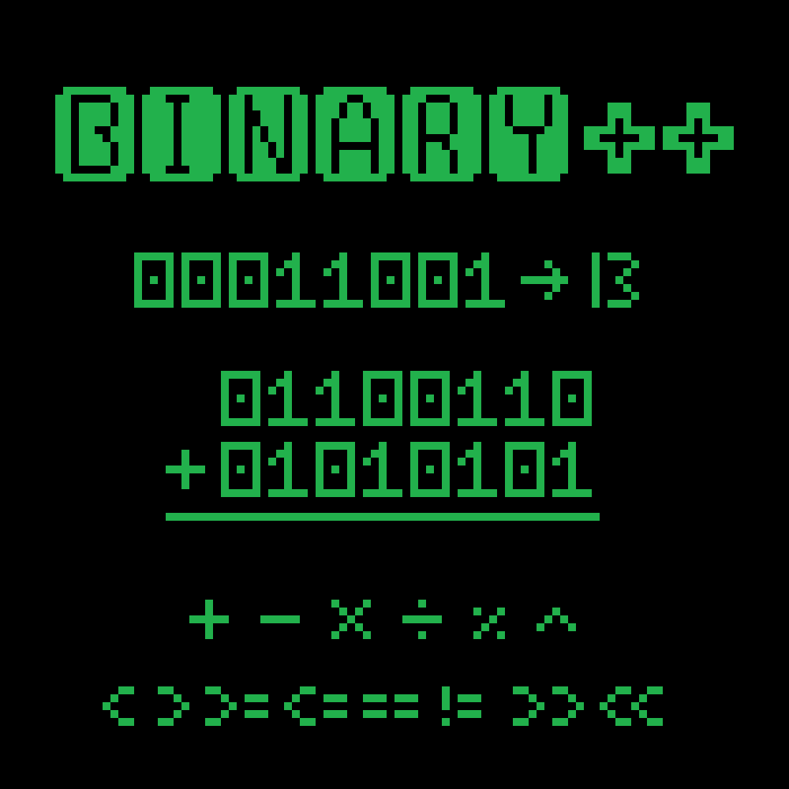

# Binary++
The Binary class represents a binary code via a string. A Binary object is initialized with either a binary string, an ASCII text string, or an integer.
The Binary class allows various arithmetic and comparison operations between two or more Binary objects (+, -, *, /, %, ^, >, <, ==).
It also offers conversions from binary to decimal, binary to ASCII text, decimal to binary, and ASCII text to binary.
  

  
## Features
- Various arithmetic operations between two Binary objects (through operator overloading)
- Various comparison operations between two Binary objects (through operator overloading)
- Conversion from binary to decimal, binary to ASCII text, decimal to binary, and ASCII text to binary.
